

<h4>||Sitio en construccion||</h4>

La transferencia de estilo es la técnica de recomponer imágenes al estilo de otras imágenes. Estos se crearon en su mayoría utilizando el código de <a href="https://github.com/jcjohnson/neural-style">Justin Johnson</a> basado en el documento de <a href="https://arxiv.org/abs/1508.06576">Gatys, Ecker y Bethge</a> que demuestra un método para rediseñar imágenes utilizando redes neuronales convolucionales.

 

"En arte, especialmente en pintura, los seres humanos han dominado la habilidad de crear experiencias visuales únicas a través de la composición de una interacción compleja entre el contenido y el estilo de una imagen. Hasta ahora, la base algorítmica de este proceso es desconocida y no existe ningún sistema artificial con capacidades similares. Sin embargo, en otras áreas clave de la percepción visual, como el reconocimiento de objetos y rostros, desempeño casi humano, se demostró recientemente mediante una clase de modelos de visión de inspiración biológica llamados Deep Neural Networks."

-Leon A. Gatys

 

¿Es esta magia o solo un aprendizaje profundo? Afortunadamente, esto no implica ninguna magia: la transferencia de estilo es una técnica divertida e interesante que muestra las capacidades y representaciones internas de las redes neuronales.

El principio de la transferencia de estilo neuronal es definir dos funciones de distancia, una que describe cuán diferente es el contenido de dos imágenes, <b>content</b>, y otra que describe la diferencia entre las dos imágenes en términos de su estilo, <b>style</b>. Luego, dadas tres imágenes, una imagen de estilo deseada, una imagen de contenido deseada y la imagen de entrada (inicializada con la imagen de contenido), intentamos transformar la imagen de entrada para minimizar la distancia de contenido con la imagen de contenido y su distancia de estilo con el imagen de estilo.

En resumen, tomaremos la imagen de entrada base, una imagen de contenido que queremos hacer coincidir y la imagen de estilo que queremos hacer coincidir. Transformaremos la imagen de entrada base al minimizar el contenido y las distancias de estilo (<b>pérdidas/losses</b>) con la propagación hacia atrás (<b>backpropagation</b>), creando una imagen que coincida con el contenido de la imagen de contenido y el estilo de la imagen de estilo.

 
## Estilizacion de una imagen

Aplicamos varios estilos de pinturas a la rectoria de la unison. Hacer click en los thumbnails para ver original.

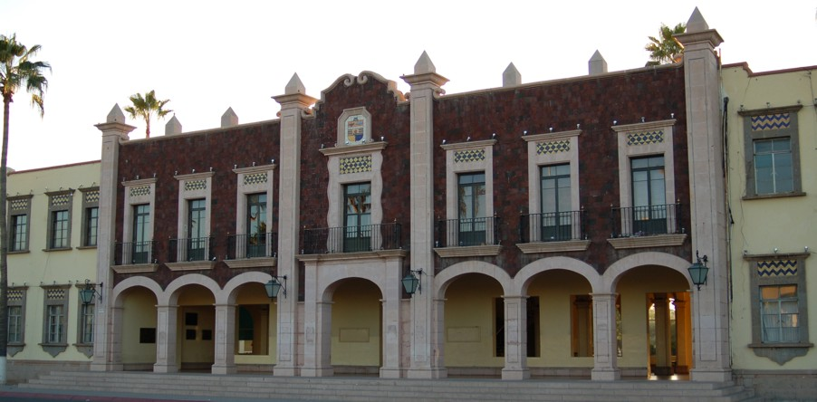

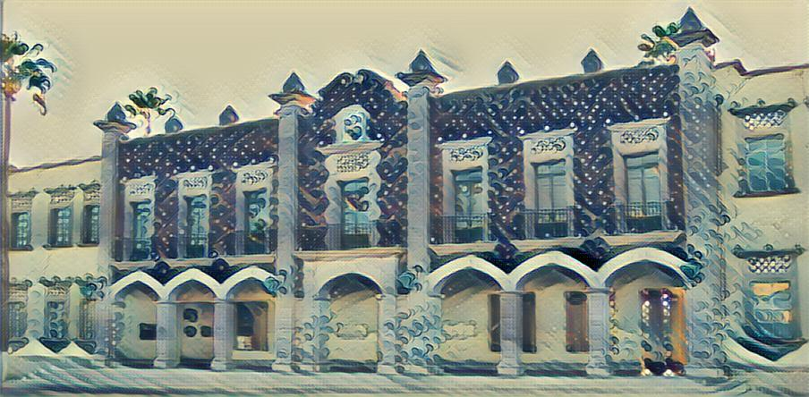
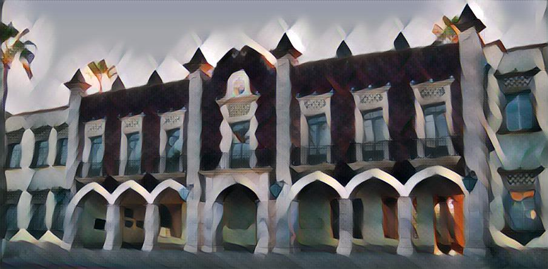

 

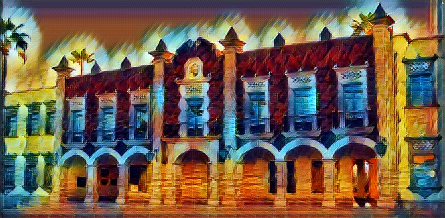
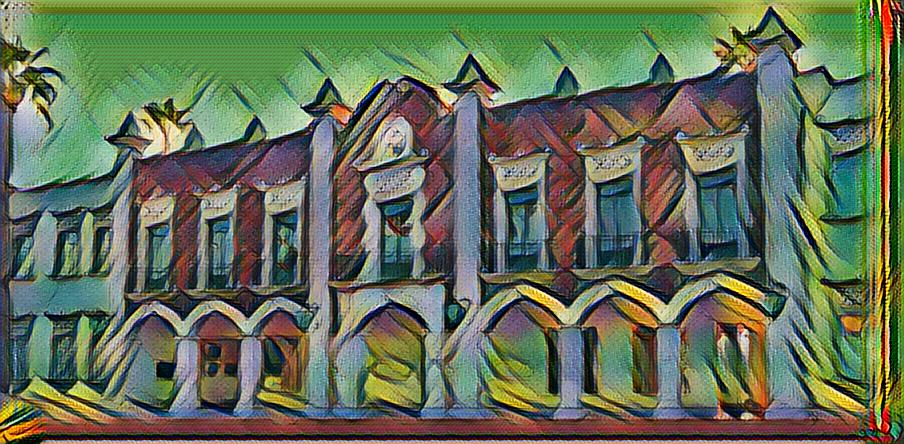

 

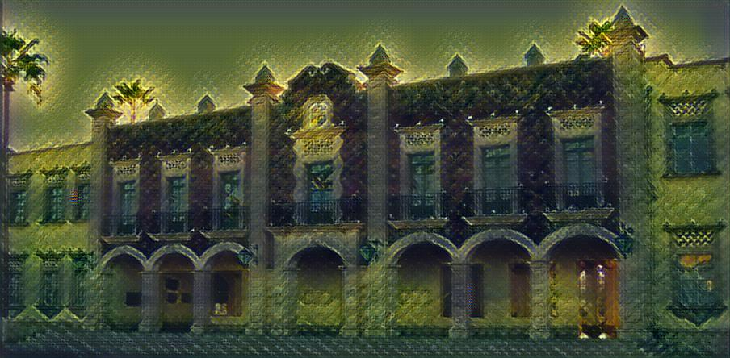
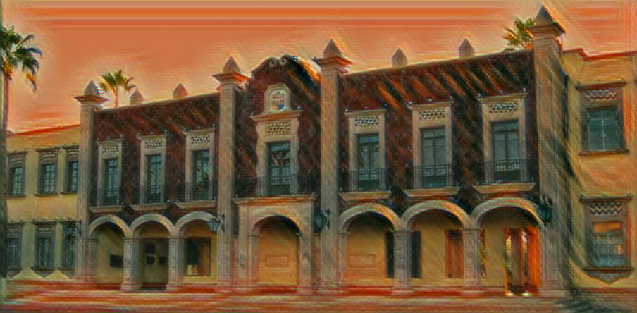

 
<h2> Definamos estilo y representaciones.</h2>

Para obtener el contenido y las representaciones de estilo de nuestra imagen, veremos algunas capas intermedias dentro de nuestro modelo. Las capas intermedias representan mapas de características que se vuelven cada vez más ordenados a medida que profundiza. En este caso, estamos utilizando la arquitectura de red VGG19, una red de clasificación de imágenes pre-entrenada. Estas capas intermedias son necesarias para definir la representación de contenido y estilo de nuestras imágenes. Para una imagen de entrada, trataremos de hacer coincidir las representaciones de destino de estilo y contenido correspondientes en estas capas intermedias.

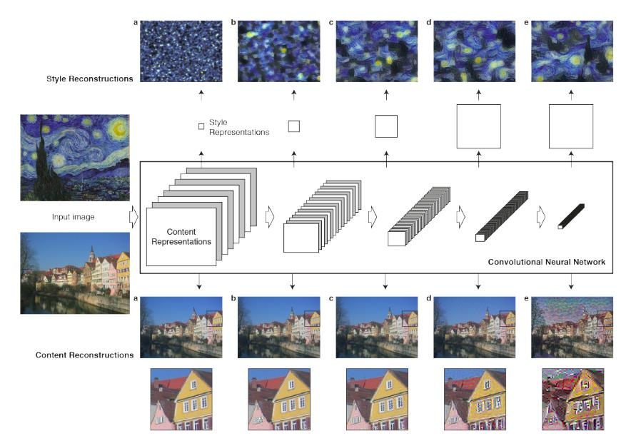

 

<h4>Reconstrucciones de contenido.</h4> Podemos visualizar la información en diferentes etapas de procesamiento en la CNN mediante la reconstrucción de la imagen de entrada al saber solo las respuestas de la red en una capa particular. Reconstruimos la imagen de entrada desde las capas de la red VGG original. Encontramos que la reconstrucción de las capas inferiores es casi perfecta (a – c). En las capas más altas de la red, la información detallada de píxeles se pierde mientras se conserva el contenido de alto nivel de la imagen (d, e).

<h4>Reconstrucciones de estilo.</h4> En la parte superior de las activaciones CNN originales, utilizamos un espacio de características que captura la información de textura de una imagen de entrada. La representación de estilo calcula las correlaciones entre las diferentes características en diferentes capas de la CNN. Reconstruimos el estilo de la imagen de entrada a partir de una representación de estilo construida en diferentes subconjuntos de capas CNN. Esto crea imágenes que coinciden con el estilo de una imagen dada en una escala creciente mientras descartan información de la disposición global de la escena.

<h4> ¿Por qué capas intermedias? </h4>

Quizás se esté preguntando por qué estos resultados intermedios dentro de nuestra red de clasificación de imágenes pre-entrenada nos permiten definir representaciones de estilo y contenido. En un nivel alto, este fenómeno puede explicarse por el hecho de que para que una red realice la clasificación de imágenes (para lo que nuestra red ha sido entrenada), debe comprender la imagen. Esto implica tomar la imagen sin procesar como píxeles de entrada y construir una representación interna a través de transformaciones que conviertan los píxeles en imágenes sin formato en una comprensión compleja de las características presentes en la imagen. Esta es también la razón por la cual las redes neuronales convolucionales pueden generalizarse bien: pueden capturar las invariantes y definir características dentro de las clases (por ejemplo, gatos contra perros) que son agnósticas al ruido de fondo y otras molestias. Por lo tanto, en algún lugar entre donde se alimenta la imagen en bruto y se emite la etiqueta de clasificación, el modelo sirve como un extractor de características complejas; por lo tanto, al acceder a las capas intermedias, podemos describir el contenido y el estilo de las imágenes de entrada.

 

<h2> Modelo </h2>

Usaremos el ya bastante conocido VGG19. Esto nos permitirá extraer los mapas de características (y posteriormente el contenido y las representaciones de estilo) del contenido, el estilo y las imágenes generadas. Como es un ejercicio didactico, solo usamos la estructura en lugar del API, por lo que acceder a las capas intermedias no sera posible con este codigo.

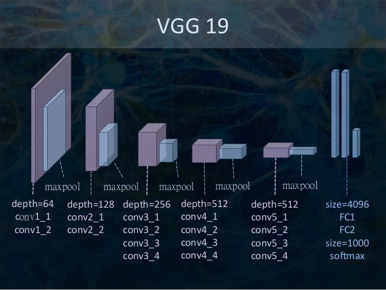

<h2> Generacion de contenido </h2>

Nuestra definición de pérdida de contenido es bastante simple. Pasaremos la red tanto la imagen de contenido deseada como nuestra imagen de entrada base. Esto devolverá los resultados de la capa intermedia (de las capas definidas anteriormente) de nuestro modelo. Luego simplemente tomamos la distancia euclidiana entre las dos representaciones intermedias de esas imágenes.

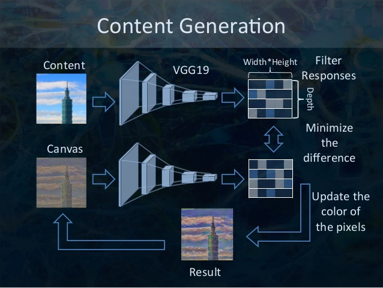

Más formalmente, la pérdida de contenido es una función que describe la distancia del contenido desde nuestra imagen de entrada x y nuestra imagen de contenido, p. Sea Cₙₙ una red neuronal convolucional profunda pre-entrenada. De nuevo, en este caso usamos VGG19. Sea X cualquier imagen, luego Cₙₙ (x) es la red alimentada por X. Deje que Xˡᵢⱼ (x) ∈ Cₙₙ (x) y Pˡᵢⱼ (x) ∈ Cₙₙ (x) describan la representación de las características intermedias respectivas de la red con entradas x y p en la capa l. Luego describimos la distancia (pérdida) de contenido formalmente como:

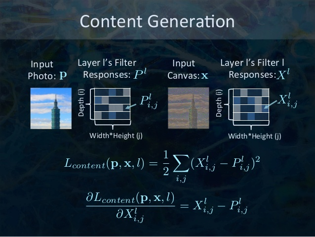

Realizamos la propagación hacia atrás de la manera habitual, de modo que minimizamos esta pérdida de contenido. Por lo tanto, cambiamos la imagen inicial hasta que genera una respuesta similar en una capa determinada como la imagen de contenido original.

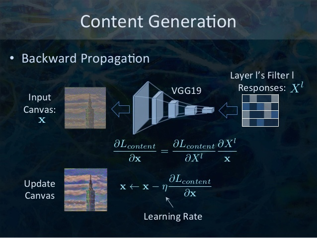

<h2> Agradecimientos y credito </h2>
Imagenes con explicaciones son de Mark Chang y fueron hechas para MLDM Monday NeuralArt
