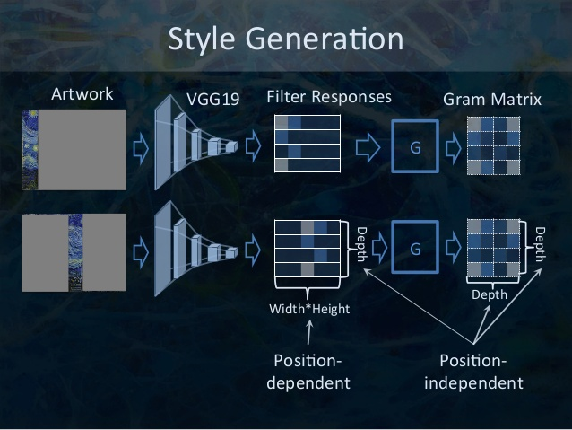
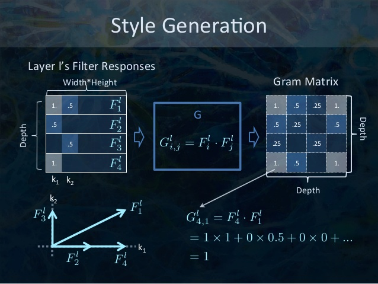
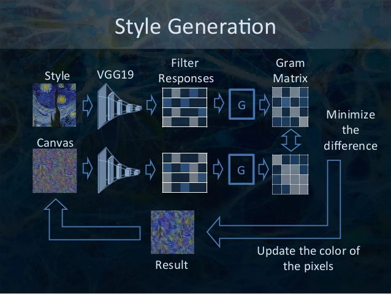
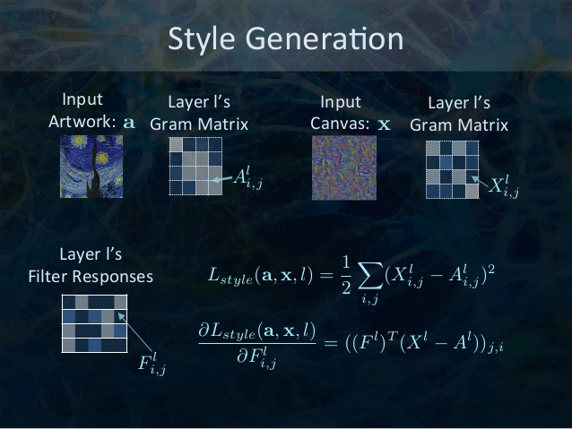
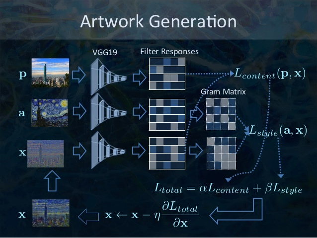
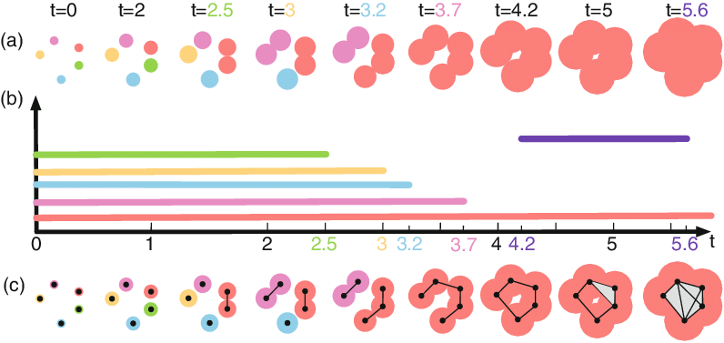

<div style="text-align: justify">
La transferencia de estilo es la técnica de recomponer imágenes al estilo de otras imágenes. Estos se crearon en su mayoría utilizando el código de <a href="https://github.com/jcjohnson/neural-style">Justin Johnson</a> basado en el documento de <a href="https://arxiv.org/abs/1508.06576">Gatys, Ecker y Bethge</a> que demuestra un método para rediseñar imágenes utilizando redes neuronales convolucionales.
</div>
<div align='center'>

</div>

<br>
<div style="text-align: justify">
"En arte, especialmente en pintura, los seres humanos han dominado la habilidad de crear experiencias visuales únicas a través de la composición de una interacción compleja entre el contenido y el estilo de una imagen. Hasta ahora, la base algorítmica de este proceso es desconocida y no existe ningún sistema artificial con capacidades similares. Sin embargo, en otras áreas clave de la percepción visual, como el reconocimiento de objetos y rostros, desempeño casi humano, se demostró recientemente mediante una clase de modelos de visión de inspiración biológica llamados Deep Neural Networks."

-Leon A. Gatys
</div>
<br>

<div style="text-align: justify">
¿Es esta magia o solo un aprendizaje profundo? Afortunadamente, esto no implica ninguna magia: la transferencia de estilo es una técnica divertida e interesante que muestra las capacidades y representaciones internas de las redes neuronales.

El principio de la transferencia de estilo neuronal es definir dos funciones de distancia, una que describe cuán diferente es el contenido de dos imágenes, <b>content</b>, y otra que describe la diferencia entre las dos imágenes en términos de su estilo, <b>style</b>. Luego, dadas tres imágenes, una imagen de estilo deseada, una imagen de contenido deseada y la imagen de entrada (inicializada con la imagen de contenido), intentamos transformar la imagen de entrada para minimizar la distancia de contenido con la imagen de contenido y su distancia de estilo con el imagen de estilo.

En resumen, tomaremos la imagen de entrada base, una imagen de contenido que queremos hacer coincidir y la imagen de estilo que queremos hacer coincidir. Transformaremos la imagen de entrada base al minimizar el contenido y las distancias de estilo (<b>pérdidas/losses</b>) con la propagación hacia atrás (<b>backpropagation</b>), creando una imagen que coincida con el contenido de la imagen de contenido y el estilo de la imagen de estilo.
</div>

<br>
<h2>Estilizacion de una imagen</h2>
<div style="text-align: justify">
Aplicamos varios estilos de pinturas a la rectoria de la unison. Hacer click en los thumbnails para ver original.

<div align='center'>

</div>

<div align = 'center'>
<a href = 'examples/style/wave.jpg'></a>


<a href = 'examples/style/udnie.jpg'></a>
<br>
<a href = 'examples/style/rain_princess.jpg'></a>


<a href = 'examples/style/la_muse.jpg'></a>

<br>
<a href = 'examples/style/the_shipwreck_of_the_minotaur.jpg'></a>


<a href = 'examples/style/the_scream.jpg'></a>
</div>

<br>
<h2> Definamos estilo y representaciones.</h2>
<div style="text-align: justify">
Para obtener el contenido y las representaciones de estilo de nuestra imagen, veremos algunas capas intermedias dentro de nuestro modelo. Las capas intermedias representan mapas de características que se vuelven cada vez más ordenados a medida que profundiza. En este caso, estamos utilizando la arquitectura de red VGG19, una red de clasificación de imágenes pre-entrenada. Estas capas intermedias son necesarias para definir la representación de contenido y estilo de nuestras imágenes. Para una imagen de entrada, trataremos de hacer coincidir las representaciones de destino de estilo y contenido correspondientes en estas capas intermedias.
</div>

<div align='center'>

</div>
<br>

<div style="text-align: justify">
<h4>Reconstrucciones de contenido.</h4> Podemos visualizar la información en diferentes etapas de procesamiento en la CNN mediante la reconstrucción de la imagen de entrada al saber solo las respuestas de la red en una capa particular. Reconstruimos la imagen de entrada desde las capas de la red VGG original. Encontramos que la reconstrucción de las capas inferiores es casi perfecta (a – c). En las capas más altas de la red, la información detallada de píxeles se pierde mientras se conserva el contenido de alto nivel de la imagen (d, e).

<h4>Reconstrucciones de estilo.</h4> En la parte superior de las activaciones CNN originales, utilizamos un espacio de características que captura la información de textura de una imagen de entrada. La representación de estilo calcula las correlaciones entre las diferentes características en diferentes capas de la CNN. Reconstruimos el estilo de la imagen de entrada a partir de una representación de estilo construida en diferentes subconjuntos de capas CNN. Esto crea imágenes que coinciden con el estilo de una imagen dada en una escala creciente mientras descartan información de la disposición global de la escena.

</div>

<h4> ¿Por qué capas intermedias? </h4>

<div style="text-align: justify">
Quizás se esté preguntando por qué estos resultados intermedios dentro de nuestra red de clasificación de imágenes pre-entrenada nos permiten definir representaciones de estilo y contenido. En un nivel alto, este fenómeno puede explicarse por el hecho de que para que una red realice la clasificación de imágenes (para lo que nuestra red ha sido entrenada), debe comprender la imagen. Esto implica tomar la imagen sin procesar como píxeles de entrada y construir una representación interna a través de transformaciones que conviertan los píxeles en imágenes sin formato en una comprensión compleja de las características presentes en la imagen. Esta es también la razón por la cual las redes neuronales convolucionales pueden generalizarse bien: pueden capturar las invariantes y definir características dentro de las clases (por ejemplo, gatos contra perros) que son agnósticas al ruido de fondo y otras molestias. Por lo tanto, en algún lugar entre donde se alimenta la imagen en bruto y se emite la etiqueta de clasificación, el modelo sirve como un extractor de características complejas; por lo tanto, al acceder a las capas intermedias, podemos describir el contenido y el estilo de las imágenes de entrada.
</div>

<br>

<h2> Modelo </h2>
<div style="text-align: justify">
Usaremos el ya bastante conocido VGG19. Esto nos permitirá extraer los mapas de características (y posteriormente el contenido y las representaciones de estilo) del contenido, el estilo y las imágenes generadas. Como es un ejercicio didactico, solo usamos la estructura en lugar del API, por lo que acceder a las capas intermedias no sera posible con este codigo.
</div>
<div align='center'>

</div>

<h2> Generacion de contenido </h2>
<div style="text-align: justify">
Nuestra definición de pérdida de contenido es bastante simple. Pasaremos la red tanto la imagen de contenido deseada como nuestra imagen de entrada base. Esto devolverá los resultados de la capa intermedia (de las capas definidas anteriormente) de nuestro modelo. Luego simplemente tomamos la distancia euclidiana entre las dos representaciones intermedias de esas imágenes.
</div>
<div align='center'>

</div>
<div style="text-align: justify">
Más formalmente, la pérdida de contenido es una función que describe la distancia del contenido desde nuestra imagen de entrada x y nuestra imagen de contenido, p. Sea Cₙₙ una red neuronal convolucional profunda pre-entrenada. De nuevo, en este caso usamos VGG19. Sea X cualquier imagen, luego Cₙₙ (x) es la red alimentada por X. Deje que Xˡᵢⱼ (x) ∈ Cₙₙ (x) y Pˡᵢⱼ (x) ∈ Cₙₙ (x) describan la representación de las características intermedias respectivas de la red con entradas x y p en la capa l. Luego describimos la distancia (pérdida) de contenido formalmente como:
</div>
<div align='center'>

</div>
<div style="text-align: justify">
Realizamos la propagación hacia atrás de la manera habitual, de modo que minimizamos esta pérdida de contenido. Por lo tanto, cambiamos la imagen inicial hasta que genera una respuesta similar en una capa determinada como la imagen de contenido original.
</div>
<div align='center'>

</div>

<h2> Generacion de estilo </h2>

<div style="text-align: justify">
La pérdida de estilo de cómputo es un poco más complicada, pero sigue el mismo principio, esta vez alimenta a nuestra red la imagen de entrada base y la imagen de estilo. Sin embargo, en lugar de comparar las salidas intermedias sin procesar de la imagen de entrada base y la imagen de estilo, comparamos las matrices de Gram de las dos salidas.
</div>

<div align='center'>

</div>

<div style="text-align: justify">
Matemáticamente, describimos la pérdida de estilo de la imagen de entrada base, <b>x</b>, y la imagen de estilo, <b>a</b>, como la distancia entre la representación de estilo (las matrices Gram) de estas imágenes. Describimos la representación de estilo de una imagen como la correlación entre las diferentes respuestas de filtro dadas por la matriz de Gram Gˡ, donde Gˡᵢⱼ es el producto interno entre el mapa de características vectorizadas i y j en la capa l. Podemos ver que Gˡᵢⱼ generado en el mapa de características para una imagen dada representa la correlación entre los mapas de características i y j.
</div>

<div align='center'>

</div>

<div style="text-align: justify">
Para generar un estilo para nuestra imagen de entrada base, realizamos un descenso de gradiente desde la imagen de contenido para transformarla en una imagen que coincida con la representación de estilo de la imagen original. Lo hacemos minimizando la distancia al cuadrado media entre el mapa de correlación de características de la imagen de estilo y la imagen de entrada.
</div>

<div align='center'>

</div>

<div style="text-align: justify">
Por lo tanto, la pérdida total de estilo a través de cada capa, donde Xˡᵢⱼ y Aˡᵢⱼ son la representación de estilo respectiva en la capa l de la imagen de entrada <b>x</b> y la imagen de estilo <b>a</b> , es,
</div>
<div align='center'>

</div>

<h2> Generacion de arte </h2>

<div style="text-align: justify">
En resumen se hace una combinacion de los dos procesos anteriromente mencionados y nos aseguramos que los filtros produzcan un canvas <b>x</b>, con el contenido de la imagen original <b>p</b> y al mismo tiempo tenga el estilo de una imagen <b>a</b>
</div>

<div align='center'>

</div>

<h2> Agradecimientos y credito </h2>
<div style="text-align: justify">
A la Universidad de Sonora y ACARUS por permitirnos usar las supercomputadora Ocotillo
Imagenes con explicaciones son de Mark Chang y fueron hechas para MLDM Monday NeuralArt
Codigo base de Logan Engstrom estudiante del MIT
</div>

<h2> Analisi topologico de datos </h2>
<div style="text-align: justify">
La topología computacional, llamado TDA por sus siglas en ingles, es una rama interdisciplinaria, relativamente nueva ,que combina elementos de la topología algebraica, computación y, recientemente probabilidad y estadística. Esta disciplina estudia, mediante el uso de algoritmos,las propiedades topológicas en espacios discretos. Lo cual implica que busca explicar la estructuras geométricas subyacentes en los datos.
</div>

<div style="text-align: justify">
Si hablamos en terminos de inteligencia aritficial, TDA pertenece a una categoría de herramientas matemáticas que <b>tienen como objetivo determinar asociaciones o patrones matemáticos </b> en datos de sistemas complejos; <b> específicamente con referencia a la forma de dichos datos</b>, sin pretender comprender sus mecanismos internos.
</div>

<h3> ¿Topología? ¿"Forma"? </h3>
<div style="text-align: justify">
Aunque puede ser difícil tratar de comprender un nuevo campo de matematica, por esta ocasion solo bastara conocer las ideas basicas sobre los recursos humanos que usaremos, para así entender el por qué se usa.
</div>

<h3>Homología persistente</h3>
<div style="text-align: justify">
La joya de la corona del TDA es la homología persistente, el método consiste en representar los datos como un complejo simplicial(nodos que representan los datos y aristas que representan la relación entre los datos), para después calcular su "filtración",es decir, los número de Betti(cantidad de hoyos en distintas dimensiones) con diferentes valores de una métrica, en general de distancia entre los nodos, que va de menos a más ; lo cual por construcción revela una representación verdadera de características del espacio subyacente de los datos.
</div>
<h3>Codigo de barras</h3>
<div style="text-align: justify">
Si bien la homología persistente, es matemáticamente compleja y representa información que a los ojos inexpertos parece ser de otra dimensión, literalmente lo es. Su representación como estructura de datos es bastante sencilla. Al calcular una filtración, de manera simplificada, estamos realizando una clusterización en diferentes niveles dimensionales al mismo tiempo donde, más que los grupos que se forman o su tamaño, lo que no interesa conocer es su persistencia, es decir, cuánto “tiempo” existen, cuando nacen, cuando mueren, en relación a la métrica. De cierta manera la forma de los datos nos una representacion super comprimida que contiene mucha informacion significativa.
</div>

<div align='center'>

</div>

<a href="https://www.researchgate.net/figure/Computing-the-persistent-homology-of-a-point-cloud-image-adapted-from-27-Fig-1_fig1_327647193">Fuente</a> 

<h3>Modificando la función de estilo.</h3>
<div style="text-align: justify">
Es por ello que pensamos utilizar un código de barras para analizar la correlación entre las activaciones de las capas de la red. Pues el metodo actual es bastante sencillo. De momento el código se modificó para aceptar otra función de estilo, y estamos a la espera de  <a href="https://github.com/scikit-tda/ripser.py/issues/67#issuecomment-475905158">la integración de scikit-tda con conda</a> para realizar pruebas.
</div>

<div style="text-align: justify">
De momento nos conformamos con una breve explicación sobre cómo se vería la nueva función; pues poner una sin antes probar los resultados no me parece lo más correcto.
El archivo a modificar es optimize.py en la carpeta src. Específicamente la sección:
</div>

```python

for layer in STYLE_LAYERS:
  features = net[layer].eval(feed_dict={style_image:style_pre})
  features = np.reshape(features, (-1, features.shape[3]))
  gram = np.matmul(features.T, features) / features.size
  style_features[layer] = gram
  
```
<div style="text-align: justify">
Como se mencionó anteriormente, la forma de tradicional de obtener la correlación entre las capas es mediante una matriz de Gram. Pero esperamos obtener mejores resultados aplicando TDA. Primero necesitamos hacer una matriz dispersa pues las matrices de activacion son considerablemente grandes.
</div>

```python

from ripser import ripser

def makeSparseDM(X, thresh):
    N = X.shape[0]
    D = pairwise_distances(X, metric='euclidean')
    [I, J] = np.meshgrid(np.arange(N), np.arange(N))
    I = I[D <= thresh]
    J = J[D <= thresh]
    V = D[D <= thresh]
    return sparse.coo_matrix((V, (I, J)), shape=(N, N)).tocsr()
    
thresh = 1
D = makeSparseDM(data, thresh)
filtration = ripser(D, distance_matrix=True)

```
<div style="text-align: justify">
  
En la estructura donde guardamos la filtración, nos centraremos en el diccionario **dgms**, que contiene la información de las muertes y nacimiento de las entidades en distintas dimensiones. De momento no quiero revelar la receta secreta, pero para darse una idea, en la nueva función de estilo tomaremos en cuenta la cantidad de grupos que mueren en un periodo de tiempo, la persistencia de grupo alpha, entre otras cosas. Independientemente de los resultados después podemos agregar informacion sobre los cociclos, para una función más compleja.
</div>

<h3>Interpretación.</h3>
<div style="text-align: justify">
Al inicio interpretar los datos puede resultar difícil, aunque intuitivo para un topólogo, nosotros solo necesitamos saber que muchas muertes rápidas, que resultan en un solo individuo, implican datos distribuidos uniformemente en el espacio por lo que no tienen relación, por el contrario grupos que persisten en el tiempo implican agrupaciones, y un super individuo desde el inicio implican mucha correlación.
</div>


